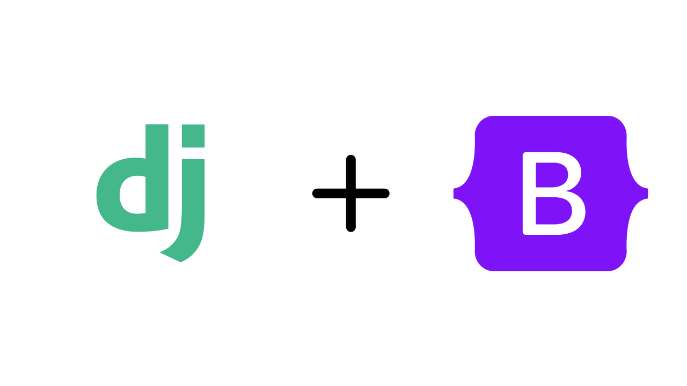

# [How to Make Your Django Project Look Great with Bootstrap](https://medium.com/@akinosoissy/make-your-django-app-look-great-with-bootstrap-41cc9045363c)

## Getting Started

### Prerequisites

- Python 3 and pip

### Installation

1. Clone the repository:

   ```bash
   git clone https://github.com/devisreal/django_bootstrap.git
   ```

2. Create and activate virtual environment

   ```bash
   python3 -m venv env
   source env/bin/activate
   ```

3. Install the required dependencies:

   ```bash
   pip install -r requirements.txt
   ```

4. Run the development server:

   ```bash
   python3 manage.py runserver
   ```

5. Open your browser and visit [http://localhost:8080](http://localhost:8080).
